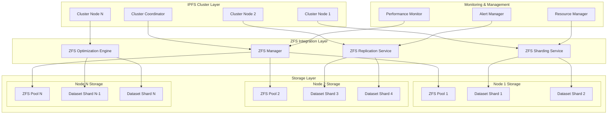

# Design Document

## Overview

This document describes the architecture for integrating IPFS Cluster with ZFS to handle one trillion pins. The system is built on principles of horizontal scaling, automatic resource management, and performance optimization through native ZFS capabilities.

## Architecture

### High-Level Architecture



### Core Components

#### 1. ZFS Manager

Central component for managing ZFS operations:

```go
type ZFSManager struct {
    pools           map[string]*ZFSPool
    shardingService *ShardingService
    replicationSvc  *ReplicationService
    optimizationEng *OptimizationEngine
    metricsCollector *MetricsCollector
}

type ZFSPool struct {
    Name            string
    Datasets        map[string]*Dataset
    CompressionRatio float64
    DeduplicationRatio float64
    FragmentationLevel float64
    ARCHitRatio     float64
}
```

#### 2. Sharding Service

Automatic data partitioning across ZFS datasets:

```go
type ShardingService struct {
    shardStrategy   ShardingStrategy
    maxPinsPerShard int64
    currentShards   map[string]*Shard
}

type Shard struct {
    ID              string
    Dataset         string
    PinCount        int64
    MaxCapacity     int64
    CompressionType string
    RecordSize      int
}

type ShardingStrategy interface {
    GetShardForCID(cid string) (*Shard, error)
    CreateNewShard() (*Shard, error)
    RebalanceShards() error
}
```

#### 3. Replication Service

Managing replication through ZFS send/receive:

```go
type ReplicationService struct {
    replicationFactor int
    snapshotSchedule  time.Duration
    incrementalSync   bool
    compressionLevel  int
}

type ReplicationJob struct {
    SourceDataset   string
    TargetNodes     []string
    SnapshotName    string
    IsIncremental   bool
    CompressionType string
}
```

#### 4. Optimization Engine

Automatic optimization of ZFS parameters:

```go
type OptimizationEngine struct {
    performanceAnalyzer *PerformanceAnalyzer
    resourcePredictor   *ResourcePredictor
    tuningEngine       *TuningEngine
}

type OptimizationRule struct {
    Condition   string
    Action      string
    Parameters  map[string]interface{}
    Priority    int
}
```

## Data Models

### Pin Storage Model

```go
type ZFSPin struct {
    CID             string    `json:"cid"`
    Shard           string    `json:"shard"`
    Dataset         string    `json:"dataset"`
    ZFSPath         string    `json:"zfs_path"`
    Checksum        string    `json:"checksum"`
    CompressionType string    `json:"compression_type"`
    CreatedAt       time.Time `json:"created_at"`
    LastAccessed    time.Time `json:"last_accessed"`
    AccessCount     int64     `json:"access_count"`
    Size            int64     `json:"size"`
    ReplicationNodes []string `json:"replication_nodes"`
}

type ShardMetadata struct {
    ShardID         string    `json:"shard_id"`
    Dataset         string    `json:"dataset"`
    PinCount        int64     `json:"pin_count"`
    TotalSize       int64     `json:"total_size"`
    CompressionRatio float64  `json:"compression_ratio"`
    FragmentationLevel float64 `json:"fragmentation_level"`
    LastOptimized   time.Time `json:"last_optimized"`
    PerformanceMetrics map[string]float64 `json:"performance_metrics"`
}
```

### ZFS Configuration Model

```go
type ZFSConfig struct {
    PoolName        string            `json:"pool_name"`
    Datasets        []DatasetConfig   `json:"datasets"`
    Compression     string            `json:"compression"`     // lz4, gzip, zstd
    Deduplication   bool              `json:"deduplication"`
    RecordSize      string            `json:"recordsize"`      // 128K, 1M, etc.
    ATime           bool              `json:"atime"`
    Sync            string            `json:"sync"`            // standard, always, disabled
    L2ARC           L2ARCConfig       `json:"l2arc"`
    Encryption      EncryptionConfig  `json:"encryption"`
}

type DatasetConfig struct {
    Name            string            `json:"name"`
    MountPoint      string            `json:"mountpoint"`
    Quota           string            `json:"quota"`
    Reservation     string            `json:"reservation"`
    Properties      map[string]string `json:"properties"`
}
```

## Component Interfaces

### ZFS Integration Interface

```go
type ZFSIntegration interface {
    // Dataset Management
    CreateDataset(name string, config DatasetConfig) error
    DeleteDataset(name string) error
    ListDatasets() ([]Dataset, error)
    
    // Pin Operations
    StorePinMetadata(pin ZFSPin) error
    RetrievePinMetadata(cid string) (*ZFSPin, error)
    DeletePinMetadata(cid string) error
    
    // Snapshot Management
    CreateSnapshot(dataset, name string) error
    ListSnapshots(dataset string) ([]Snapshot, error)
    RollbackToSnapshot(dataset, snapshot string) error
    
    // Replication
    SendSnapshot(dataset, snapshot, target string) error
    ReceiveSnapshot(source string) error
    
    // Performance Optimization
    OptimizeDataset(dataset string) error
    GetPerformanceMetrics(dataset string) (*PerformanceMetrics, error)
    TuneParameters(dataset string, params map[string]interface{}) error
}
```

### Sharding Interface

```go
type ShardingInterface interface {
    // Shard Management
    CreateShard(config ShardConfig) (*Shard, error)
    GetShardForCID(cid string) (*Shard, error)
    ListShards() ([]*Shard, error)
    
    // Load Balancing
    RebalanceShards() error
    GetShardLoad(shardID string) (*ShardLoad, error)
    
    // Migration
    MigratePins(sourceShard, targetShard string, cids []string) error
    
    // Optimization
    OptimizeShardLayout() error
    PredictShardGrowth(shardID string) (*GrowthPrediction, error)
}
```

## Error Handling

### Error Types

```go
type ZFSError struct {
    Type        ErrorType `json:"type"`
    Message     string    `json:"message"`
    Dataset     string    `json:"dataset,omitempty"`
    Operation   string    `json:"operation"`
    Timestamp   time.Time `json:"timestamp"`
    Recoverable bool      `json:"recoverable"`
}

type ErrorType int

const (
    ErrorTypePoolFull ErrorType = iota
    ErrorTypeDatasetCorrupted
    ErrorTypeReplicationFailed
    ErrorTypePerformanceDegraded
    ErrorTypeInsufficientSpace
    ErrorTypeChecksumMismatch
)
```

### Recovery Strategies

```go
type RecoveryStrategy interface {
    CanRecover(error ZFSError) bool
    Recover(error ZFSError) error
    GetRecoveryTime(error ZFSError) time.Duration
}

type AutoRecoveryEngine struct {
    strategies map[ErrorType]RecoveryStrategy
    maxRetries int
    backoffStrategy BackoffStrategy
}
```

## Testing Strategy

### Performance Testing

1. **Load Testing**: Simulation of one trillion pins with various access patterns
2. **Stress Testing**: Testing under extreme loads (10M ops/sec)
3. **Endurance Testing**: Long-term system stability testing
4. **Scalability Testing**: Testing addition of new nodes

### Integration Testing

```go
type IntegrationTestSuite struct {
    zfsManager      *ZFSManager
    clusterNodes    []*ClusterNode
    testDatasets    []string
    performanceGoals map[string]float64
}

func (suite *IntegrationTestSuite) TestTrillionPinsWorkload() {
    // Test handling of one trillion pins
}

func (suite *IntegrationTestSuite) TestZFSReplication() {
    // Test ZFS replication
}

func (suite *IntegrationTestSuite) TestAutoOptimization() {
    // Test automatic optimization
}
```

### Monitoring and Observability

#### Metrics Collection

```go
type MetricsCollector struct {
    zfsMetrics      *ZFSMetrics
    clusterMetrics  *ClusterMetrics
    systemMetrics   *SystemMetrics
}

type ZFSMetrics struct {
    ARCHitRatio        float64
    CompressionRatio   float64
    DeduplicationRatio float64
    FragmentationLevel float64
    IOPSRead          int64
    IOPSWrite         int64
    ThroughputRead    int64
    ThroughputWrite   int64
    LatencyRead       time.Duration
    LatencyWrite      time.Duration
}
```

#### Alerting System

```go
type AlertingSystem struct {
    rules       []AlertRule
    channels    []NotificationChannel
    escalation  EscalationPolicy
}

type AlertRule struct {
    Name        string
    Condition   string
    Threshold   float64
    Duration    time.Duration
    Severity    AlertSeverity
    Actions     []AlertAction
}
```

## Security Considerations

### ZFS Encryption Integration

```go
type EncryptionManager struct {
    keyProvider    KeyProvider
    encryptionType EncryptionType
    keyRotation    KeyRotationPolicy
}

type KeyProvider interface {
    GetKey(dataset string) ([]byte, error)
    RotateKey(dataset string) error
    BackupKeys() error
}
```

### Access Control

```go
type AccessController struct {
    permissions map[string][]Permission
    delegation  ZFSDelegation
}

type Permission struct {
    Resource    string
    Action      string
    Conditions  []Condition
}
```

## Deployment Architecture

### Multi-Tier Storage

```yaml
storage_tiers:
  hot_tier:
    media_type: "nvme_ssd"
    zfs_properties:
      compression: "lz4"
      recordsize: "128K"
      sync: "standard"
    capacity: "100TB"
    
  warm_tier:
    media_type: "sata_ssd"
    zfs_properties:
      compression: "gzip-6"
      recordsize: "1M"
      sync: "disabled"
    capacity: "1PB"
    
  cold_tier:
    media_type: "hdd"
    zfs_properties:
      compression: "zstd"
      recordsize: "1M"
      sync: "disabled"
    capacity: "10PB"
```

### Network Architecture

```yaml
network_topology:
  cluster_network:
    bandwidth: "100Gbps"
    latency: "<1ms"
    protocol: "InfiniBand/Ethernet"
    
  replication_network:
    bandwidth: "40Gbps"
    latency: "<5ms"
    protocol: "Ethernet"
    
  management_network:
    bandwidth: "10Gbps"
    latency: "<10ms"
    protocol: "Ethernet"
```

This architecture provides:

1. **Scalability**: Horizontal scaling through sharding
2. **Performance**: ZFS parameter optimization for workload
3. **Reliability**: Automatic replication and recovery
4. **Efficiency**: Compression, deduplication and intelligent data placement
5. **Monitoring**: Complete system observability
6. **Security**: Encryption and access control