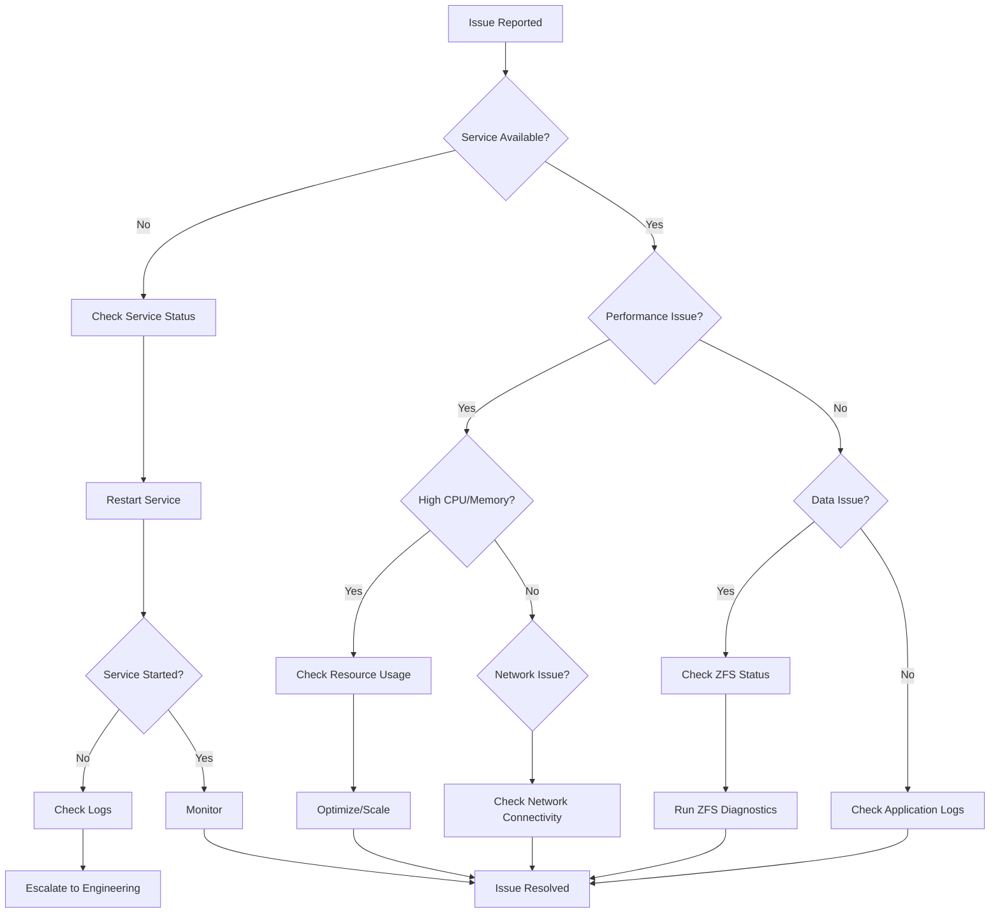

# IPFS Cluster ZFS Integration - Operations Runbook

## Overview

This runbook provides step-by-step procedures for operating and maintaining the IPFS Cluster ZFS Integration system. It covers routine operations, troubleshooting, disaster recovery, and maintenance procedures.

## Table of Contents

1. [Daily Operations](#daily-operations)
2. [Monitoring and Alerting](#monitoring-and-alerting)
3. [Troubleshooting](#troubleshooting)
4. [Maintenance Procedures](#maintenance-procedures)
5. [Disaster Recovery](#disaster-recovery)
6. [Performance Optimization](#performance-optimization)
7. [Capacity Management](#capacity-management)
8. [Security Operations](#security-operations)

## Daily Operations

### Health Checks

#### Automated Health Check Script

```bash
#!/bin/bash
# Daily health check for IPFS Cluster ZFS Integration

echo "=== IPFS Cluster ZFS Health Check $(date) ==="

# Check cluster status
echo "1. Checking cluster status..."
if ipfs-cluster-ctl status > /dev/null 2>&1; then
    echo "✓ Cluster is responsive"
    ipfs-cluster-ctl status | grep -E "(PINNED|ERROR|UNPINNED)" | wc -l
else
    echo "✗ Cluster is not responsive"
    exit 1
fi

# Check ZFS pool health
echo "2. Checking ZFS pools..."
for pool in hot-tier warm-tier cold-tier; do
    if zpool list "$pool" > /dev/null 2>&1; then
        status=$(zpool list -H -o health "$pool")
        if [[ "$status" == "ONLINE" ]]; then
            echo "✓ Pool $pool: $status"
        else
            echo "✗ Pool $pool: $status"
        fi
    else
        echo "✗ Pool $pool: NOT FOUND"
    fi
done

# Check disk usage
echo "3. Checking disk usage..."
for pool in hot-tier warm-tier cold-tier; do
    if zpool list "$pool" > /dev/null 2>&1; then
        usage=$(zpool list -H -o capacity "$pool" | tr -d '%')
        if [[ $usage -lt 80 ]]; then
            echo "✓ Pool $pool usage: ${usage}%"
        elif [[ $usage -lt 90 ]]; then
            echo "⚠ Pool $pool usage: ${usage}% (WARNING)"
        else
            echo "✗ Pool $pool usage: ${usage}% (CRITICAL)"
        fi
    fi
done

# Check performance metrics
echo "4. Checking performance metrics..."
arc_hit_ratio=$(cat /proc/spl/kstat/zfs/arcstats | grep "hits" | head -1 | awk '{print $3}')
arc_miss=$(cat /proc/spl/kstat/zfs/arcstats | grep "misses" | head -1 | awk '{print $3}')
if [[ $arc_hit_ratio -gt 0 ]] && [[ $arc_miss -gt 0 ]]; then
    hit_ratio=$(echo "scale=2; $arc_hit_ratio / ($arc_hit_ratio + $arc_miss) * 100" | bc)
    if (( $(echo "$hit_ratio > 85" | bc -l) )); then
        echo "✓ ARC hit ratio: ${hit_ratio}%"
    else
        echo "⚠ ARC hit ratio: ${hit_ratio}% (LOW)"
    fi
fi

echo "=== Health Check Complete ==="
```

#### Manual Health Checks

**Check Cluster Peers:**
```bash
ipfs-cluster-ctl peers ls
```

**Check Pin Status:**
```bash
# Check total pins
ipfs-cluster-ctl pin ls | wc -l

# Check pin status distribution
ipfs-cluster-ctl status | grep -E "PINNED|ERROR|UNPINNED" | sort | uniq -c
```

**Check ZFS Status:**
```bash
# Pool status
zpool status

# Dataset usage
zfs list -o name,used,avail,refer,mountpoint

# Performance stats
zpool iostat -v 1 5
```

### Log Monitoring

**Check IPFS Cluster Logs:**
```bash
# Recent logs
journalctl -u ipfs-cluster -n 100

# Follow logs
journalctl -u ipfs-cluster -f

# Error logs only
journalctl -u ipfs-cluster -p err
```

**Check ZFS Logs:**
```bash
# ZFS events
zpool events -v

# Kernel messages
dmesg | grep -i zfs
```

## Monitoring and Alerting

### Key Metrics to Monitor

#### Cluster Metrics
- Peer connectivity status
- Pin operation success rate
- Replication factor compliance
- API response times

#### ZFS Metrics
- Pool health status
- Disk usage per pool/dataset
- ARC hit ratio
- Compression ratio
- Fragmentation level
- I/O operations per second

#### System Metrics
- CPU utilization
- Memory usage
- Network throughput
- Disk I/O

### Alert Thresholds

```yaml
alerts:
  critical:
    - zfs_pool_health != "ONLINE"
    - disk_usage > 90%
    - cluster_peers_down > 1
    - arc_hit_ratio < 70%
    
  warning:
    - disk_usage > 80%
    - arc_hit_ratio < 85%
    - fragmentation > 30%
    - pin_error_rate > 5%
    
  info:
    - new_peer_joined
    - snapshot_created
    - maintenance_started
```

### Monitoring Script

```bash
#!/bin/bash
# Continuous monitoring script

METRICS_FILE="/var/log/ipfs-cluster/metrics.log"
ALERT_THRESHOLD_DISK=80
ALERT_THRESHOLD_ARC=85

while true; do
    timestamp=$(date '+%Y-%m-%d %H:%M:%S')
    
    # Collect ZFS metrics
    for pool in hot-tier warm-tier cold-tier; do
        if zpool list "$pool" > /dev/null 2>&1; then
            usage=$(zpool list -H -o capacity "$pool" | tr -d '%')
            health=$(zpool list -H -o health "$pool")
            
            echo "$timestamp ZFS_POOL pool=$pool usage=$usage health=$health" >> "$METRICS_FILE"
            
            # Check thresholds
            if [[ $usage -gt $ALERT_THRESHOLD_DISK ]]; then
                echo "$timestamp ALERT DISK_USAGE pool=$pool usage=${usage}%" >> "$METRICS_FILE"
            fi
        fi
    done
    
    # Collect cluster metrics
    if peer_count=$(ipfs-cluster-ctl peers ls 2>/dev/null | wc -l); then
        echo "$timestamp CLUSTER_PEERS count=$peer_count" >> "$METRICS_FILE"
    fi
    
    sleep 60
done
```

## Troubleshooting

### Common Issues and Solutions

#### Issue: High Memory Usage

**Symptoms:**
- System running out of memory
- ZFS ARC consuming too much RAM
- Application performance degradation

**Diagnosis:**
```bash
# Check memory usage
free -h

# Check ARC usage
cat /proc/spl/kstat/zfs/arcstats | grep -E "size|c_max|c_min"

# Check process memory
ps aux --sort=-%mem | head -10
```

**Solution:**
```bash
# Limit ARC size (adjust based on available RAM)
echo $((16 * 1024 * 1024 * 1024)) > /sys/module/zfs/parameters/zfs_arc_max

# Make permanent
echo "options zfs zfs_arc_max=17179869184" >> /etc/modprobe.d/zfs.conf
```

#### Issue: Slow Pin Operations

**Symptoms:**
- Pin operations taking longer than expected
- High I/O wait times
- Poor cluster performance

**Diagnosis:**
```bash
# Check I/O statistics
iostat -x 1 5

# Check ZFS performance
zpool iostat -v 1 5

# Check fragmentation
zpool list -o name,frag

# Check record size
zfs get recordsize
```

**Solution:**
```bash
# Optimize record size for workload
zfs set recordsize=128K hot-tier/ipfs-cluster/hot-shards
zfs set recordsize=1M warm-tier/ipfs-cluster/warm-shards

# Enable compression if not already enabled
zfs set compression=lz4 hot-tier/ipfs-cluster

# Defragment if needed
zpool scrub hot-tier
```

#### Issue: Cluster Split-Brain

**Symptoms:**
- Inconsistent pin states across peers
- Peers reporting different cluster states
- Replication failures

**Diagnosis:**
```bash
# Check peer connectivity
ipfs-cluster-ctl peers ls

# Check pin status across peers
for peer in $(ipfs-cluster-ctl peers ls | awk '{print $1}'); do
    echo "Peer: $peer"
    ipfs-cluster-ctl --host "/ip4/$peer/tcp/9094" status
done
```

**Solution:**
```bash
# Force state sync
ipfs-cluster-ctl state sync

# If severe, restore from backup
ipfs-cluster-service state import /backup/cluster-state.json

# Restart cluster service
systemctl restart ipfs-cluster
```

#### Issue: ZFS Pool Degraded

**Symptoms:**
- Pool status shows DEGRADED
- Reduced performance
- Potential data loss risk

**Diagnosis:**
```bash
# Check pool status
zpool status -v

# Check disk health
smartctl -a /dev/sdX

# Check ZFS events
zpool events -v
```

**Solution:**
```bash
# Replace failed disk
zpool replace pool-name /dev/old-disk /dev/new-disk

# If disk is temporarily unavailable
zpool online pool-name /dev/disk

# Clear errors after fixing
zpool clear pool-name
```

### Troubleshooting Flowchart



## Maintenance Procedures

### Routine Maintenance

#### Weekly Tasks

**ZFS Scrub:**
```bash
#!/bin/bash
# Weekly ZFS scrub

for pool in hot-tier warm-tier cold-tier; do
    echo "Starting scrub for $pool..."
    zpool scrub "$pool"
    
    # Wait for completion
    while zpool status "$pool" | grep -q "scrub in progress"; do
        sleep 300  # Check every 5 minutes
    done
    
    echo "Scrub completed for $pool"
    zpool status "$pool"
done
```

**Snapshot Management:**
```bash
#!/bin/bash
# Weekly snapshot cleanup

# Create weekly snapshots
for dataset in $(zfs list -H -o name | grep ipfs-cluster); do
    snapshot_name="${dataset}@weekly-$(date +%Y%m%d)"
    zfs snapshot "$snapshot_name"
    echo "Created snapshot: $snapshot_name"
done

# Clean old snapshots (keep 4 weeks)
for dataset in $(zfs list -H -o name | grep ipfs-cluster); do
    zfs list -t snapshot -H -o name | grep "$dataset@weekly-" | sort | head -n -4 | while read snapshot; do
        zfs destroy "$snapshot"
        echo "Removed old snapshot: $snapshot"
    done
done
```

#### Monthly Tasks

**Performance Analysis:**
```bash
#!/bin/bash
# Monthly performance report

REPORT_FILE="/var/log/ipfs-cluster/monthly-report-$(date +%Y%m).txt"

echo "IPFS Cluster ZFS Performance Report - $(date)" > "$REPORT_FILE"
echo "================================================" >> "$REPORT_FILE"

# Cluster statistics
echo "Cluster Statistics:" >> "$REPORT_FILE"
ipfs-cluster-ctl status | grep -E "PINNED|ERROR" | sort | uniq -c >> "$REPORT_FILE"

# ZFS statistics
echo -e "\nZFS Pool Statistics:" >> "$REPORT_FILE"
zpool list >> "$REPORT_FILE"

echo -e "\nCompression Ratios:" >> "$REPORT_FILE"
zfs get compressratio | grep -v VALUE >> "$REPORT_FILE"

echo -e "\nFragmentation Levels:" >> "$REPORT_FILE"
zpool list -o name,frag >> "$REPORT_FILE"

# Performance metrics
echo -e "\nPerformance Metrics:" >> "$REPORT_FILE"
cat /proc/spl/kstat/zfs/arcstats | grep -E "hits|misses|c_max|size" >> "$REPORT_FILE"

echo "Report generated: $REPORT_FILE"
```

### Planned Maintenance

#### System Updates

**Pre-Update Checklist:**
1. Create full system snapshot
2. Backup cluster state
3. Notify users of maintenance window
4. Verify rollback procedures

```bash
#!/bin/bash
# Pre-update backup script

# Create ZFS snapshots
for pool in hot-tier warm-tier cold-tier; do
    for dataset in $(zfs list -H -o name | grep "$pool/ipfs-cluster"); do
        snapshot_name="${dataset}@pre-update-$(date +%Y%m%d-%H%M)"
        zfs snapshot "$snapshot_name"
        echo "Created backup snapshot: $snapshot_name"
    done
done

# Export cluster state
ipfs-cluster-service state export /backup/cluster-state-$(date +%Y%m%d-%H%M).json

# Backup configuration
cp -r /var/lib/ipfs-cluster /backup/config-$(date +%Y%m%d-%H%M)/

echo "Pre-update backup completed"
```

**Update Procedure:**
```bash
#!/bin/bash
# System update procedure

# Stop services
systemctl stop ipfs-cluster
systemctl stop ipfs

# Update system packages
apt update && apt upgrade -y

# Update ZFS if needed
apt install zfsutils-linux

# Update IPFS Cluster
cd /opt/ipfs-cluster
git pull origin master
make build
cp ipfs-cluster-* /usr/local/bin/

# Start services
systemctl start ipfs
systemctl start ipfs-cluster

# Verify operation
sleep 30
ipfs-cluster-ctl status
```

#### Hardware Maintenance

**Disk Replacement:**
```bash
#!/bin/bash
# Disk replacement procedure

POOL_NAME="$1"
OLD_DISK="$2"
NEW_DISK="$3"

if [[ -z "$POOL_NAME" || -z "$OLD_DISK" || -z "$NEW_DISK" ]]; then
    echo "Usage: $0 <pool_name> <old_disk> <new_disk>"
    exit 1
fi

echo "Replacing disk $OLD_DISK with $NEW_DISK in pool $POOL_NAME"

# Check pool status
zpool status "$POOL_NAME"

# Replace disk
zpool replace "$POOL_NAME" "$OLD_DISK" "$NEW_DISK"

# Monitor resilver progress
while zpool status "$POOL_NAME" | grep -q "resilver in progress"; do
    echo "Resilver in progress..."
    zpool status "$POOL_NAME" | grep "resilver"
    sleep 60
done

echo "Disk replacement completed"
zpool status "$POOL_NAME"
```

## Disaster Recovery

### Backup Procedures

#### Automated Backup Script

```bash
#!/bin/bash
# Automated backup script

BACKUP_DIR="/backup/ipfs-cluster"
RETENTION_DAYS=30

# Create backup directory
mkdir -p "$BACKUP_DIR/$(date +%Y%m%d)"

# Export cluster state
ipfs-cluster-service state export "$BACKUP_DIR/$(date +%Y%m%d)/cluster-state.json"

# Backup configuration
cp -r /var/lib/ipfs-cluster "$BACKUP_DIR/$(date +%Y%m%d)/config"

# Create ZFS snapshots and send to backup location
for pool in hot-tier warm-tier cold-tier; do
    for dataset in $(zfs list -H -o name | grep "$pool/ipfs-cluster"); do
        snapshot_name="${dataset}@backup-$(date +%Y%m%d-%H%M)"
        zfs snapshot "$snapshot_name"
        
        # Send to backup pool (if available)
        if zpool list backup-pool > /dev/null 2>&1; then
            zfs send "$snapshot_name" | zfs receive "backup-pool/${dataset##*/}-$(date +%Y%m%d)"
        fi
    done
done

# Clean old backups
find "$BACKUP_DIR" -type d -mtime +$RETENTION_DAYS -exec rm -rf {} \;

echo "Backup completed: $BACKUP_DIR/$(date +%Y%m%d)"
```

### Recovery Procedures

#### Complete System Recovery

```bash
#!/bin/bash
# Complete system recovery procedure

BACKUP_DATE="$1"
BACKUP_DIR="/backup/ipfs-cluster/$BACKUP_DATE"

if [[ ! -d "$BACKUP_DIR" ]]; then
    echo "Backup directory not found: $BACKUP_DIR"
    exit 1
fi

echo "Starting system recovery from backup: $BACKUP_DATE"

# Stop services
systemctl stop ipfs-cluster
systemctl stop ipfs

# Restore ZFS datasets
for pool in hot-tier warm-tier cold-tier; do
    if zpool list "backup-pool" > /dev/null 2>&1; then
        for backup_dataset in $(zfs list -H -o name | grep "backup-pool.*$BACKUP_DATE"); do
            original_name=$(echo "$backup_dataset" | sed "s/backup-pool\///;s/-$BACKUP_DATE//")
            zfs send "$backup_dataset" | zfs receive "$pool/$original_name"
        done
    fi
done

# Restore configuration
rm -rf /var/lib/ipfs-cluster
cp -r "$BACKUP_DIR/config" /var/lib/ipfs-cluster
chown -R ipfs-cluster:ipfs-cluster /var/lib/ipfs-cluster

# Import cluster state
ipfs-cluster-service state import "$BACKUP_DIR/cluster-state.json"

# Start services
systemctl start ipfs
systemctl start ipfs-cluster

# Verify recovery
sleep 30
ipfs-cluster-ctl status

echo "System recovery completed"
```

#### Partial Recovery (Single Dataset)

```bash
#!/bin/bash
# Recover single dataset

DATASET="$1"
SNAPSHOT="$2"

if [[ -z "$DATASET" || -z "$SNAPSHOT" ]]; then
    echo "Usage: $0 <dataset> <snapshot>"
    exit 1
fi

echo "Rolling back $DATASET to $SNAPSHOT"

# Stop cluster temporarily
systemctl stop ipfs-cluster

# Rollback dataset
zfs rollback "$DATASET@$SNAPSHOT"

# Start cluster
systemctl start ipfs-cluster

echo "Dataset recovery completed"
```

### Emergency Procedures

#### Emergency Shutdown

```bash
#!/bin/bash
# Emergency shutdown procedure

echo "EMERGENCY SHUTDOWN INITIATED"

# Stop cluster gracefully
timeout 60 systemctl stop ipfs-cluster || systemctl kill ipfs-cluster

# Stop IPFS
timeout 30 systemctl stop ipfs || systemctl kill ipfs

# Export pools safely
for pool in hot-tier warm-tier cold-tier; do
    zpool export "$pool" || echo "Failed to export $pool"
done

echo "Emergency shutdown completed"
```

#### Split-Brain Recovery

```bash
#!/bin/bash
# Split-brain recovery procedure

echo "Starting split-brain recovery"

# Stop all cluster nodes
for node in $(ipfs-cluster-ctl peers ls | awk '{print $1}'); do
    ssh "$node" "systemctl stop ipfs-cluster"
done

# Choose authoritative node (usually the one with most recent data)
AUTHORITATIVE_NODE="$1"

if [[ -z "$AUTHORITATIVE_NODE" ]]; then
    echo "Usage: $0 <authoritative_node_ip>"
    exit 1
fi

# Export state from authoritative node
ssh "$AUTHORITATIVE_NODE" "ipfs-cluster-service state export /tmp/recovery-state.json"

# Import state on all other nodes
for node in $(ipfs-cluster-ctl peers ls | awk '{print $1}'); do
    if [[ "$node" != "$AUTHORITATIVE_NODE" ]]; then
        scp "$AUTHORITATIVE_NODE:/tmp/recovery-state.json" "$node:/tmp/"
        ssh "$node" "ipfs-cluster-service state clean && ipfs-cluster-service state import /tmp/recovery-state.json"
    fi
done

# Restart all nodes
for node in $(ipfs-cluster-ctl peers ls | awk '{print $1}'); do
    ssh "$node" "systemctl start ipfs-cluster"
done

echo "Split-brain recovery completed"
```

This operations runbook provides comprehensive procedures for managing the IPFS Cluster ZFS Integration system. Each procedure includes step-by-step instructions, error handling, and verification steps to ensure reliable operations.