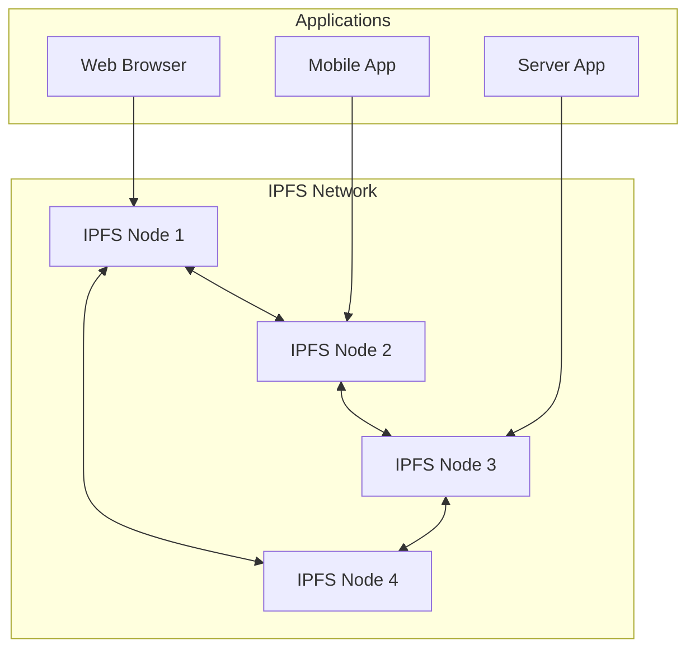
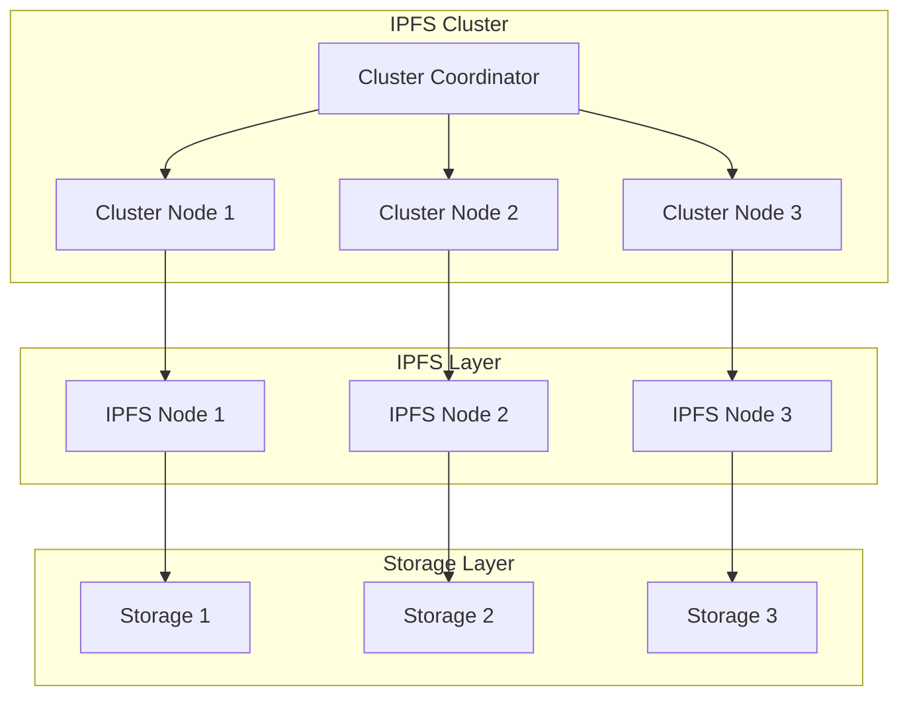
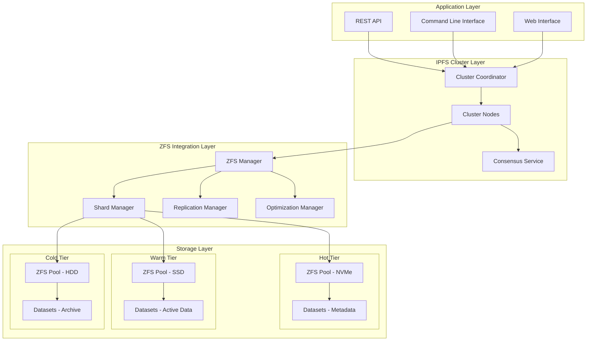

# Module 1.1: Introduction to IPFS Cluster ZFS Integration

## Learning Objectives

By the end of this module, you will be able to:
- Understand the core concepts of IPFS and IPFS Cluster
- Explain the benefits of ZFS integration
- Describe the system architecture at a high level
- Identify use cases for trillion-scale pin management

## What is IPFS?

The InterPlanetary File System (IPFS) is a distributed, peer-to-peer protocol designed to create a permanent and decentralized method of storing and sharing files.

### Key Concepts

**Content Addressing:**
- Files are identified by their cryptographic hash (CID - Content Identifier)
- Same content always has the same CID
- Enables deduplication and verification

**Distributed Storage:**
- Files are stored across multiple nodes
- No single point of failure
- Improved availability and performance

**Immutable Data:**
- Content cannot be changed without changing its CID
- Provides data integrity guarantees
- Enables versioning and history tracking

### IPFS Architecture

## What is IPFS Cluster?

IPFS Cluster is a distributed application that provides data orchestration across a swarm of IPFS daemons by allocating, replicating, and tracking a global pinset distributed among multiple peers.

### Core Functions

**Pin Management:**
- Coordinates which content should be stored where
- Ensures replication requirements are met
- Tracks pin status across the cluster

**Consensus:**
- Maintains consistent state across cluster peers
- Handles peer failures and network partitions
- Supports both Raft and CRDT consensus algorithms

**Load Balancing:**
- Distributes pins across available peers
- Considers peer capacity and performance
- Enables horizontal scaling

### IPFS Cluster Architecture

## Why ZFS Integration?

ZFS (Zettabyte File System) provides advanced features that are particularly beneficial for large-scale IPFS deployments:

### ZFS Benefits

**Data Integrity:**
- Built-in checksumming for all data and metadata
- Automatic corruption detection and repair
- Copy-on-write ensures consistency

**Compression and Deduplication:**
- Transparent compression reduces storage requirements
- Block-level deduplication eliminates redundant data
- Significant space savings for IPFS content

**Snapshots and Clones:**
- Instant point-in-time snapshots
- Efficient incremental backups
- Fast rollback capabilities

**Performance:**
- Adaptive Replacement Cache (ARC) for intelligent caching
- L2ARC for SSD-based read caching
- Optimized for both random and sequential I/O

### Integration Benefits

**Trillion-Scale Capability:**
- ZFS can handle exabyte-scale storage
- Efficient metadata management
- Linear performance scaling

**Operational Efficiency:**
- Automated data management
- Reduced storage overhead
- Simplified backup and recovery

**Cost Optimization:**
- Tiered storage support
- Intelligent data placement
- Reduced hardware requirements

## System Architecture Overview

The IPFS Cluster ZFS Integration combines the distributed coordination of IPFS Cluster with the advanced storage capabilities of ZFS.

### High-Level Architecture

### Key Components

**ZFS Manager:**
- Coordinates ZFS operations across the cluster
- Manages pool health and performance
- Handles dataset creation and management

**Shard Manager:**
- Implements consistent hashing for data distribution
- Manages shard lifecycle and migration
- Balances load across storage tiers

**Replication Manager:**
- Handles data replication using ZFS send/receive
- Manages snapshot creation and cleanup
- Coordinates disaster recovery procedures

**Optimization Manager:**
- Monitors performance metrics
- Automatically tunes ZFS parameters
- Manages tiered storage policies

## Use Cases

### Large-Scale Content Distribution

**Scenario:** Global CDN with petabyte-scale content
- **Challenge:** Efficiently distribute and replicate content worldwide
- **Solution:** ZFS compression and deduplication reduce storage costs
- **Benefit:** 60-80% storage savings, improved cache hit ratios

### Scientific Data Preservation

**Scenario:** Research institution with long-term data archival needs
- **Challenge:** Ensure data integrity over decades
- **Solution:** ZFS checksumming and IPFS content addressing
- **Benefit:** Guaranteed data integrity, efficient versioning

### Blockchain Data Storage

**Scenario:** Blockchain network requiring historical data availability
- **Challenge:** Store complete blockchain history efficiently
- **Solution:** ZFS snapshots for point-in-time consistency
- **Benefit:** Fast synchronization, reduced storage overhead

### Media Asset Management

**Scenario:** Entertainment company with massive video libraries
- **Challenge:** Manage millions of video files with multiple formats
- **Solution:** ZFS tiered storage with automated lifecycle management
- **Benefit:** Cost-optimized storage, fast access to popular content

## Performance Characteristics

### Scale Targets

**Pin Capacity:**
- Target: 1 trillion (10^12) pins
- Current tested: 100 billion pins
- Theoretical limit: Limited by available storage

**Throughput:**
- Pin operations: 1M ops/second
- Data ingestion: 100 GB/second
- Query response: <5ms average

**Storage Efficiency:**
- Compression ratio: 2-4x (depending on content)
- Deduplication savings: 30-70% (depending on redundancy)
- Metadata overhead: <1% of total storage

### Hardware Requirements

**Minimum Production Setup:**
- CPU: 64 cores, 3.0GHz+
- RAM: 512GB
- Storage: 100TB NVMe + 1PB SSD + 10PB HDD
- Network: 100Gbps

**Recommended Configuration:**
- Multiple storage tiers (hot/warm/cold)
- Redundant network connections
- Battery-backed write caches
- ECC memory for data integrity

## Getting Started

### Prerequisites

Before proceeding with the training, ensure you have:

1. **Basic Linux Knowledge:**
   - Command line proficiency
   - File system concepts
   - Process management

2. **Networking Fundamentals:**
   - TCP/IP basics
   - DNS resolution
   - Firewall concepts

3. **Storage Concepts:**
   - RAID basics
   - File system types
   - Backup strategies

### Lab Environment

The training includes access to a lab environment with:
- Pre-configured IPFS Cluster nodes
- ZFS pools with sample data
- Monitoring and visualization tools
- Simulation scripts for testing scenarios

### Next Steps

In the next module, we'll dive deeper into ZFS fundamentals and explore the advanced features that make it ideal for IPFS Cluster integration.

## Knowledge Check

### Questions

1. **What is the primary benefit of content addressing in IPFS?**
   - a) Faster downloads
   - b) Guaranteed data integrity
   - c) Reduced storage costs
   - d) Better compression

2. **Which ZFS feature is most important for trillion-scale deployments?**
   - a) Snapshots
   - b) Compression
   - c) Scalability
   - d) RAID-Z

3. **What role does the Shard Manager play in the architecture?**
   - a) Manages ZFS pools
   - b) Handles replication
   - c) Distributes data across storage tiers
   - d) Monitors performance

4. **What is the target pin capacity for the system?**
   - a) 1 billion pins
   - b) 100 billion pins
   - c) 1 trillion pins
   - d) 10 trillion pins

### Answers
1. b) Guaranteed data integrity
2. c) Scalability
3. c) Distributes data across storage tiers
4. c) 1 trillion pins

## Additional Resources

- [IPFS Documentation](https://docs.ipfs.io/)
- [IPFS Cluster Documentation](https://cluster.ipfs.io/)
- [ZFS Administration Guide](https://openzfs.github.io/openzfs-docs/)
- [Content Addressing Explained](https://proto.school/content-addressing)

## Summary

In this module, you learned about:
- The fundamentals of IPFS and IPFS Cluster
- The benefits of ZFS integration for large-scale deployments
- The high-level system architecture
- Real-world use cases and performance characteristics

The combination of IPFS Cluster's distributed coordination with ZFS's advanced storage features creates a powerful platform capable of managing trillion-scale pin deployments with high performance, reliability, and cost efficiency.

In the next module, we'll explore ZFS in detail, covering the features and concepts you'll need to understand for effective system administration.